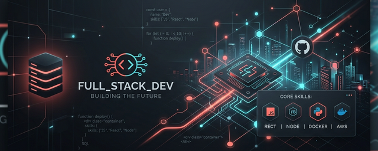

<div align="center">



<br/>

[](https://itsdrex.dev/)

<p align="center">
  <a href="https://itsdrex.dev/"></a>
  <a href="https://www.linkedin.com/in/sylvain-drexler"></a>
  <a href="mailto:contact@itsdrex.dev"></a>
</p>

</div>

---

### 👨‍💻 Sobre mí

Desarrollador **Full Stack** con más de **5 años de experiencia** construyendo plataformas web, sistemas administrativos y soluciones e-commerce. Me enfoco en **rendimiento, usabilidad y escalabilidad**, transformando ideas en productos digitales con arquitectura limpia y código sostenible.

```javascript
const sylvain = {
  location: "Misiones, Argentina",
  role: "Full Stack Developer",
  stack: ["React", "Laravel", "WordPress", "Node.js"],
  languages: ["Español", "Francés", "Inglés", "Alemán"],
  focus: "Arquitectura limpia y performance",
  passion: "Construir experiencias web modernas e intuitivas"
};
```

---

<div align="center">

### 🛠️ Tech Stack

#### **Frontend**


#### **Backend**


#### **E-commerce & CMS**


#### **Herramientas & DevOps**


</div>

---

### 🚀 Highlights & Logros

<div align="center">
  <table>
    <tr>
      <td align="center">✅ <strong>15+</strong> proyectos web completados</td>
      <td align="center">🛒 <strong>10+</strong> tiendas online en producción</td>
    </tr>
    <tr>
      <td align="center">📈 <strong>+60%</strong> mejora en conversiones promedio</td>
      <td align="center">🌍 <strong>4 idiomas:</strong> ES · FR · EN · DE</td>
    </tr>
    <tr>
      <td align="center">🔗 Integraciones avanzadas con APIs modernas</td>
      <td align="center">🏗️ Arquitectura limpia y código escalable</td>
    </tr>
  </table>
</div>

---

### 💼 Proyectos Destacados

| 🌟 Proyecto | 📄 Descripción | ⚙️ Stack |
|---|---|---|
| **[Centro de Autogestión - ATM](https://atmisiones.gob.ar/)** | Portal de autogestión para la Agencia Tributaria de Misiones. | `Laravel` `React` `MySQL` |
| **[TSGroup](https://tsgroup.com.ar/)** | Portal de empleo y administración empresarial. | `WordPress` `PHP` `MySQL` |
| **[Med+ Contribu](https://medplus.com.ar/)** | Plataforma de gestión médica con turnos y expedientes. | `Laravel` `React` `REST API` |

---

### 📊 Estadísticas y Actividad

<div align="center">
  
  
  

  <br/><br/>

  [](https://github.com/drex25)

  <br/><br/>

  [](https://wakatime.com/@dwilvins)

</div>

---

<br/>

<div align="center">
  
  <br/><br/>
  <sub>Hecho con pasión por <b><a href="https://itsdrex.dev" style="color: #FF6B6B; text-decoration: none;">Sylvain Drexler</a></b></sub>
</div>
